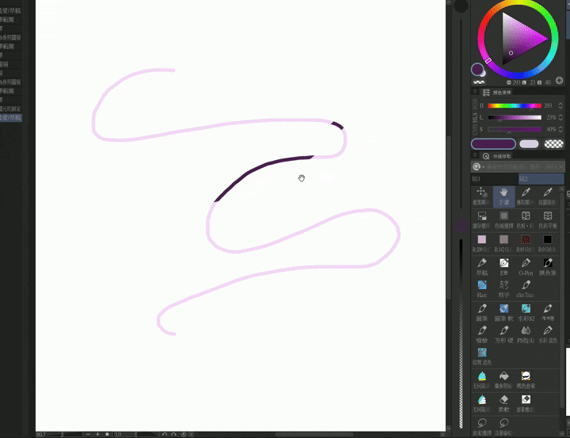
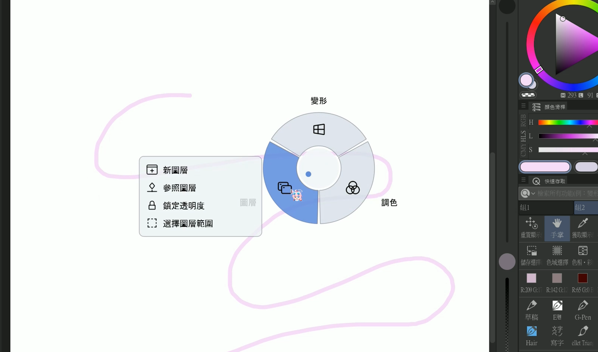
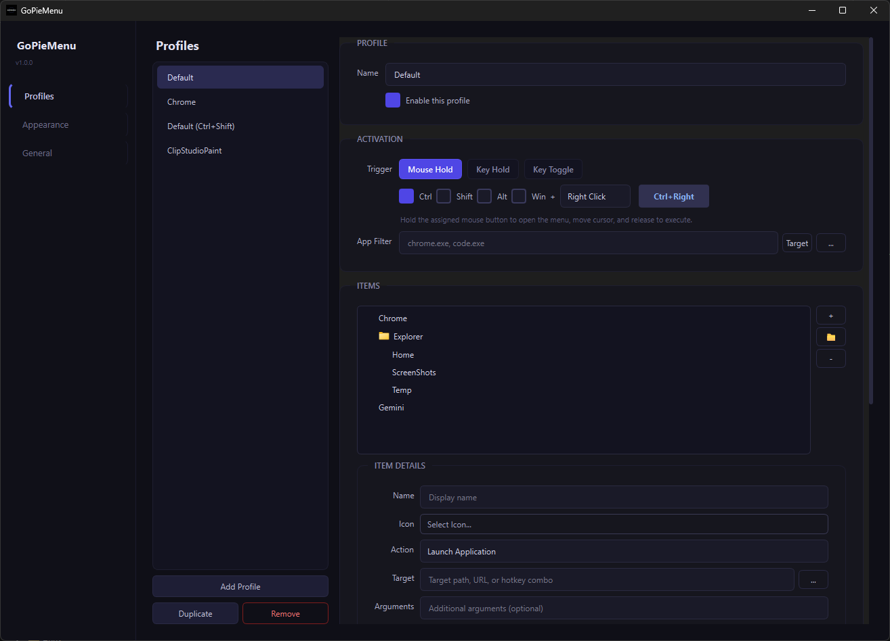
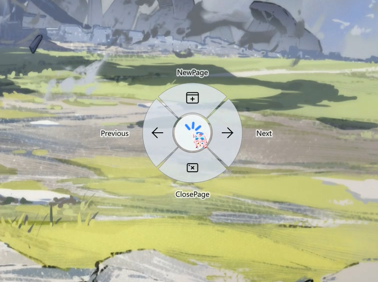

# GoPieMenu

<p align="center">
  <b>A fast, customizable radial (pie) menu for Windows.</b><br>
  Inspired by the intuitive interaction design of Blender.
</p>

<p align="center">
  
  
  
  
</p>

---

## 🎬 Demo



---

## 📖 Overview

**GoPieMenu** is a powerful and highly customizable **radial (pie) menu utility for Windows**.
It allows you to trigger shortcuts, launch applications, or execute commands directly from your **cursor position**, enabling a much faster workflow than traditional menus.

The design is heavily inspired by the efficient pie menus used in **Blender**, bringing the same interaction style to any Windows application.

---

### 🚀 Why GoPieMenu?

| Feature | Traditional Menu | GoPieMenu |
| :--- | :--- | :--- |
| **Speed** | Slow (requires precise clicks) | **Instant** (muscle memory) |
| **Focus** | Moves eye to taskbar/ribbon | **Stay centered** on cursor |
| **Customization** | Fixed by developer | **Fully programmable** JSON |
| **Context** | Global only | **App-specific** profiles |

---

## 📷 Interface Preview





---

## ✨ Features

### 🎯 Context-Aware Profiles

Create different pie menus for different applications.

Examples:

* Photoshop → brush / layer shortcuts
* VS Code → build / run / terminal
* Browser → tab management

---

### ⚡ Multiple Activation Modes

Choose the interaction style that fits your workflow:

**Mouse Hold**

* Hold a mouse button
* Move to a slice
* Release to execute

**Key Hold**

* Hold a keyboard key
* Move to select
* Release key to execute
* *(no mouse click required)*

**Key Toggle**

* Press a key to open the menu
* Move to select
* Click to execute

---

### 🎨 Modern UI

* Minimalist dark theme
* Smooth animations
* Glassmorphism visual style
* Clean radial layout

---

### 🧠 Smart Window Picker

Quickly bind menus to specific applications by selecting from currently running windows.

Example:

```
photoshop.exe
code.exe
chrome.exe
```

---

### 🧩 Icon Support

Includes a **Notion-style icon picker** with search.

You can:

* search icons
* assign custom icons
* visually organize actions

---

### 💾 Import / Export

Configurations are stored as **JSON**.

You can easily:

* backup your settings
* share profiles with others
* version control configurations

---

### 🚀 High Performance

Uses **low-level Win32 hooks** to ensure:

* extremely fast input detection
* reliable triggers
* minimal overhead

---

## 🚀 Usage

### 1️⃣ Open Settings

Right-click the **GoPieMenu tray icon** and select:

```
Settings
```

---

### 2️⃣ Create a Profile

Add a new profile and configure a **Trigger**.

Example triggers:

* `Ctrl + Mouse Right Button`
* `Ctrl + Shift + M`

---

### 3️⃣ Add Menu Items

Define what each slice does:

* Launch Application
* Send Hotkey
* Open URL
* Run Command

---

### 4️⃣ Set Application Filter (Optional)

Limit the menu to specific apps.

Example:

```
chrome.exe
photoshop.exe
AnyApp.exe
```

The pie menu will only appear when that application is focused.

---

### 5️⃣ Activate

Use your trigger and move your mouse to select a slice.

Enjoy a **much faster workflow** 🚀

---

## 🛠 Build From Source

GoPieMenu is built with **C++20** and **Qt 6.9**.

### Requirements

* Visual Studio 2022 (MSVC)
* CMake 3.16+
* Qt 6.9.0 or newer

---

### Clone Repository

```bash
git clone https://github.com/RyuuMeow/GoPieMenu.git
cd GoPieMenu
```

---

### Configure CMake

```bash
mkdir build
cd build

cmake .. -DCMAKE_PREFIX_PATH="C:/Path/To/Qt/6.9.0/msvc2022_64"
```

---

### Build

```bash
cmake --build . --config Release
```

---

## 📁 Project Structure

```
src/
 ├─ core/      Win32 hooks & action execution
 ├─ models/    Data structures & JSON serialization
 └─ ui/        Qt interface & radial menu rendering
```

---

## 🤝 Contributing

Contributions are welcome!

You can help by:

* reporting bugs
* suggesting features
* submitting pull requests
* improving documentation

If you find GoPieMenu useful, consider giving the project a ⭐ on GitHub.

---

## 🙏 Credits

Default icons are provided by **Iconoir**
https://github.com/iconoir-icons/iconoir

---

## 📜 License

This project is licensed under the **GNU General Public License v3.0 (GPL-3.0)**.

You are free to use, modify, and distribute this software under the terms of the GPL-3.0 license.

See the full license text here:
https://www.gnu.org/licenses/gpl-3.0.html
