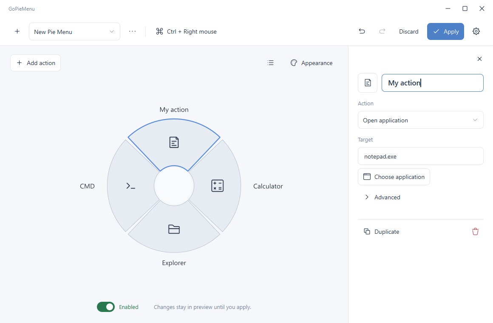

# GoPieMenu

[English](README.md) · [繁體中文](README.zh-TW.md) · [简体中文](README.zh-CN.md)

A customizable Windows radial menu for shortcuts, applications, files, websites, and commands.



## Edit your menu

1. Open **Settings** from the tray icon. Use **+** beside the menu selector to create and select a menu. The adjacent three-dot menu contains New, Duplicate, and Delete; deleting selects the first remaining menu.
2. Click a slice to edit it. **Add action** creates an action or a submenu. Empty targets and shortcuts can be saved as placeholders; triggering them does nothing. Right-click an action in the preview or organizer to **Duplicate** or **Delete action**.
3. Open **Arrange actions** and drag anywhere on a row to reorder it without changing the current selection. The three-line handle and insertion line mark the interaction; the list scrolls near its edges. Double-click a submenu or choose **Edit actions** to edit it in the same workspace. Submenus contain actions only.
4. Edit the trigger and application scope from the trigger summary. Mouse hold supports independent **Ctrl / Shift / Alt / Win** modifiers and five mouse buttons. The **Enabled / Disabled** switch controls the menu; new and copied menus start disabled.
5. Changes appear immediately in the preview, whose position stays fixed when names change. **Apply** validates and saves them before the running menu changes. **Apply** and **Discard** stay visible and activate when there are changes. Ctrl+Z and Ctrl+Y undo and redo.

Switching menus preserves all drafts. Closing the editor hides it to the tray and preserves edits; quitting asks how to handle unapplied changes. Import creates an undoable draft. Invalid imports and failed saves leave the current configuration intact.

The default trigger is **Ctrl + right mouse button**: hold, point, and release. Keyboard hold and keyboard toggle are also supported. Toggle mode confirms on a left click; Escape cancels. Application-specific menus take precedence over global menus.

## Appearance and icons

The editor uses a light Frost theme with a custom white title bar, rounded dialogs, and a matching tray menu. The default Frost menu is nearly opaque; choose **Frost** again to apply the new preset to an existing configuration. Appearance keeps the preview visible and offers presets and size, with detailed geometry, colors, and animation under Advanced. The preview hint stays visible when a menu is disabled.

The [color picker](resources/demo/ColorPicker.png) combines a hue ring, saturation/value square, H/S/V/opacity sliders and numeric fields, RGB/RGBA hex input, and 12 recent colors. **Use color** updates the draft; **Cancel** leaves it unchanged.

The icon picker has search, a virtualized grid, and Clear. Built-in icons are embedded; custom SVG, PNG, JPEG, and ICO files can be placed in the icon folder opened from Settings. Preview and runtime share rendering and icon resolution.

Configuration remains version 1.0 JSON, stored under Qt's application-data directory. Export and import are available in Settings.

The application and [tray menu](resources/demo/TrayMenu.png) use the new Pie Menu artwork and light styling. The GitHub button beside **About** opens this project's repository.

## Build and verify

Requires Windows, Visual Studio 2022 with C++ tools, CMake 3.21+, and Qt 6.9 with Widgets, Quick, QML, Quick Controls, SVG, and Test.

```powershell
./scripts/build.ps1 -QtRoot "C:/Qt/6.9.0/msvc2022_64"
```

This builds Release and runs core and UI regression tests at 100%, 125%, 150%, and 200% scale. Test screenshots are written to `build/artifacts`. Use `-SkipTests` for an incremental build.

Run `build/Release/GoPieMenu.exe --settings` with Qt's bin directory on PATH. `--preview` opens an isolated temporary configuration without global hooks, action execution, or Windows startup changes.

To package, copy the executable into a deployment folder and run:

```powershell
windeployqt --release --qmldir src/ui/qml --no-translations deploy/GoPieMenu.exe
```

CI builds, tests, packages Qt/QML dependencies, and compiles the installer on pull requests and main-branch pushes. Tags beginning with `v` additionally publish the installer.

See [architecture and validation](docs/architecture.md) for module boundaries, test coverage, measurements, and remaining hardware checks.

## Credits and license

[Iconoir](https://github.com/iconoir-icons/iconoir) supplies the built-in icons under its MIT license. GoPieMenu is [GPL-3.0](LICENSE).
