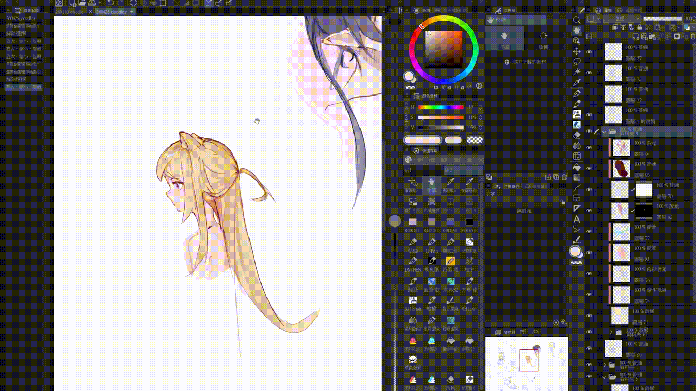
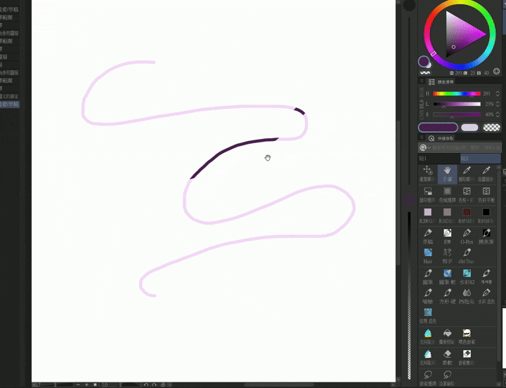
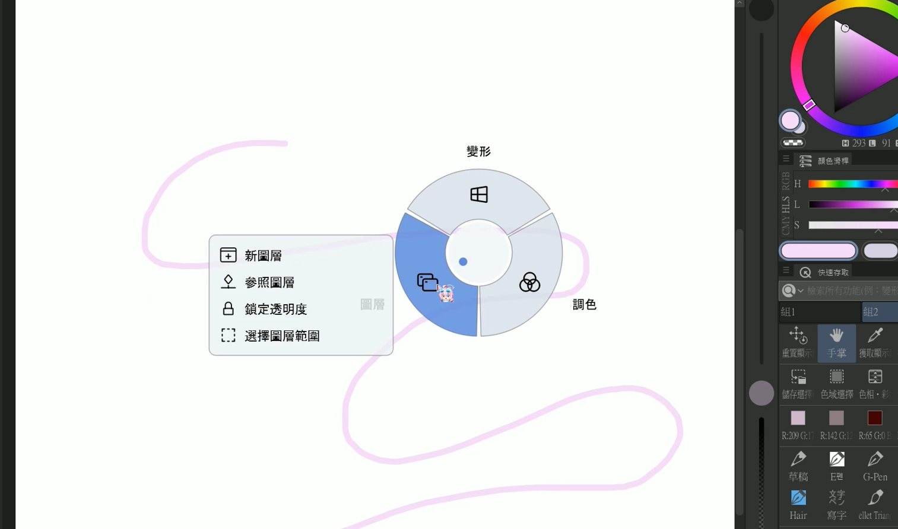
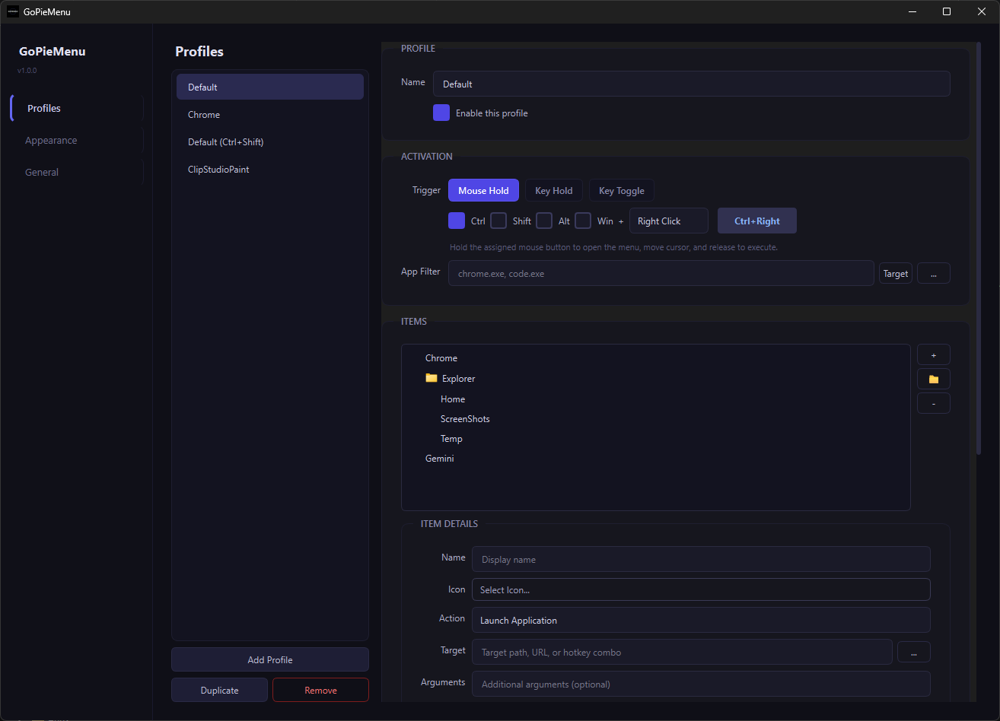
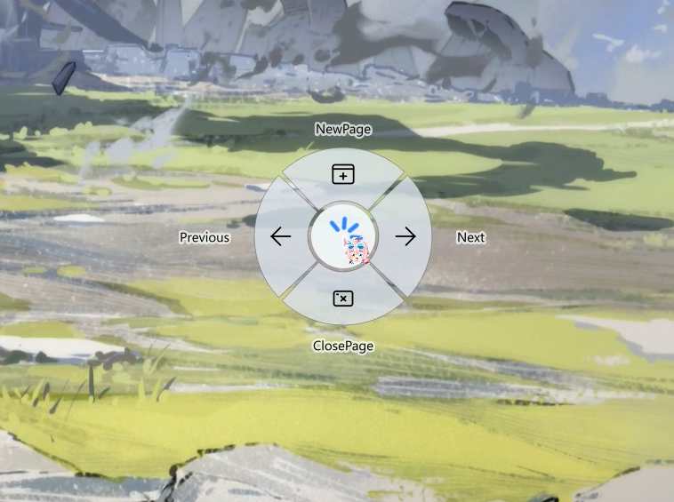

# GoPieMenu

<p align="center">
  <a href="README.md">English</a> |
  <a href="README.zh-TW.md">繁體中文</a> |
  <a href="README.zh-CN.md">简体中文</a>
</p>

<p align="center">
  <b>一款快速、可自訂的 Windows 放射狀（圓盤）選單。</b><br>
  靈感來自 Blender 直覺的互動設計。
</p>

<p align="center">
  
  
  
  
</p>

---

## 🎬 Demo





---

## 📖 概覽

**GoPieMenu** 是一款強大且高度可自訂的 **Windows 放射狀（圓盤）選單工具**。
它能讓你直接從 **游標位置** 觸發快捷鍵、啟動應用程式或執行命令，比傳統選單帶來更快的工作流程。

設計深受 **Blender** 高效率圓盤選單啟發，將相同的互動方式帶到任何 Windows 應用程式中。

---

### 🚀 為什麼選擇 GoPieMenu？

| 功能 | 傳統選單 | GoPieMenu |
| :--- | :--- | :--- |
| **速度** | 慢（需要精準點擊） | **即時**（肌肉記憶） |
| **專注** | 視線移到工作列/功能區 | **保持在游標中心** |
| **自訂** | 由開發者固定 | **JSON 完全可程式化** |
| **情境** | 僅全域 | **應用程式專屬**設定檔 |

---

## 📷 介面預覽





---

## ✨ 功能特色

### 🎯 情境感知設定檔

為不同應用程式建立不同的圓盤選單。

範例：

* Photoshop → 筆刷 / 圖層快捷鍵
* VS Code → 建置 / 執行 / 終端機
* 瀏覽器 → 分頁管理

---

### ⚡ 多種啟動模式

選擇最適合你工作流程的互動方式：

**滑鼠長按**

* 按住滑鼠按鍵
* 移動到選單切片
* 放開即可執行

**鍵盤長按**

* 按住鍵盤按鍵
* 移動以選取
* 放開按鍵即可執行
* *（不需要滑鼠點擊）*

**按鍵切換**

* 按下按鍵開啟選單
* 移動以選取
* 點擊即可執行

---

### 🎨 現代化介面

* 極簡深色主題
* 流暢動畫
* 玻璃擬態視覺風格
* 清晰的放射狀版面

---

### 🧠 智慧視窗選擇器

從目前執行中的視窗快速選取，將選單綁定到特定應用程式。

範例：

```
photoshop.exe
code.exe
chrome.exe
```

---

### 🧩 圖示支援

內建支援搜尋的 **Notion 風格圖示選擇器**。

你可以：

* 搜尋圖示
* 指派自訂圖示
* 以視覺方式整理動作

---

### 💾 匯入 / 匯出

設定會儲存為 **JSON**。

你可以輕鬆：

* 備份設定
* 與他人分享設定檔
* 將設定納入版本控制

---

### 🚀 高效能

使用 **低階 Win32 hooks** 以確保：

* 極快的輸入偵測
* 可靠的觸發
* 極低的額外負擔

---

## 🚀 使用方式

### 1️⃣ 開啟設定

在 **GoPieMenu 系統匣圖示** 上按右鍵並選擇：

```
Settings
```

---

### 2️⃣ 建立設定檔

新增設定檔並設定 **觸發條件**。

觸發條件範例：

* `Ctrl + Mouse Right Button`
* `Ctrl + Shift + M`

---

### 3️⃣ 新增選單項目

定義每個切片要執行的內容：

* 啟動應用程式
* 傳送快捷鍵
* 開啟 URL
* 執行命令

---

### 4️⃣ 設定應用程式篩選器（可選）

限制選單只在特定應用程式中使用。

範例：

```
chrome.exe
photoshop.exe
AnyApp.exe
```

圓盤選單只會在該應用程式取得焦點時顯示。

---

### 5️⃣ 啟動

使用你的觸發條件，並移動滑鼠選取切片。

享受 **更快速的工作流程** 🚀

---

## 🛠 從原始碼建置

GoPieMenu 使用 **C++20** 與 **Qt 6.9** 建置。

### 需求

* Visual Studio 2022 (MSVC)
* CMake 3.16+
* Qt 6.9.0 或更新版本

---

### 複製儲存庫

```bash
git clone https://github.com/RyuuMeow/GoPieMenu.git
cd GoPieMenu
```

---

### 設定 CMake

```bash
mkdir build
cd build

cmake .. -DCMAKE_PREFIX_PATH="C:/Path/To/Qt/6.9.0/msvc2022_64"
```

---

### 建置

```bash
cmake --build . --config Release
```

---

## 📁 專案結構

```
src/
 ├─ core/      Win32 hooks 與動作執行
 ├─ models/    資料結構與 JSON 序列化
 └─ ui/        Qt 介面與放射狀選單渲染
```

---

## 🤝 貢獻

歡迎貢獻！

你可以透過以下方式協助：

* 回報錯誤
* 建議功能
* 提交 pull request
* 改善文件

如果你覺得 GoPieMenu 實用，歡迎在 GitHub 上給這個專案一顆 ⭐。

---

## 🙏 致謝

預設圖示由 **Iconoir** 提供
https://github.com/iconoir-icons/iconoir

---

## 📜 授權

本專案採用 **GNU General Public License v3.0 (GPL-3.0)** 授權。

你可以依照 GPL-3.0 授權條款自由使用、修改與散布本軟體。

完整授權條款請見：
https://www.gnu.org/licenses/gpl-3.0.html
